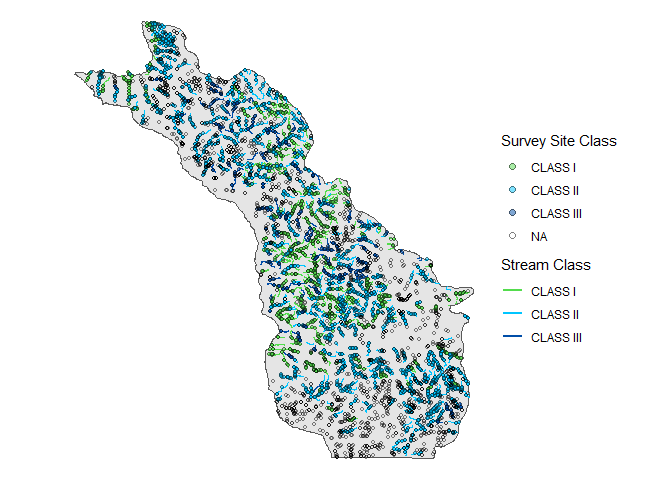
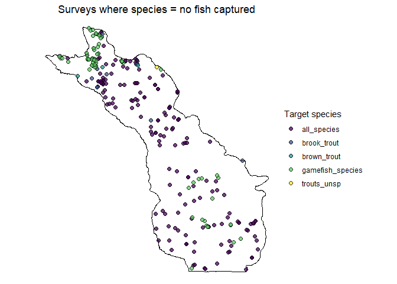
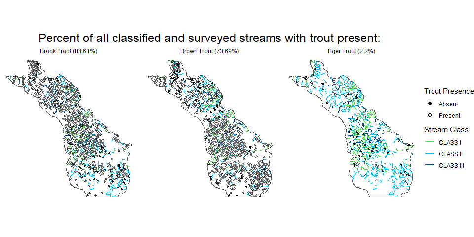
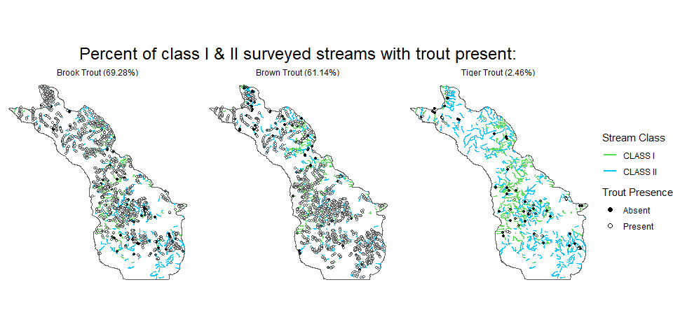

How common are trout in Driftless streams
================
Bryan Maitland
29 July 2021

## Overview

What is the percentage of Driftless area streams in which Brook, Brown,
or Tiger Trout are present?

## 1\. Data

### FMDB surveys and efforts

Download all surveys from 1994-2020 on streams using backpack and stream
shockers, retaining only surveys that are complete and proofed:

``` r
# data pulled from FMDB in hidden step
df_surveys_raw <- read_rds(here("data", "surveys_raw_20210707.rds"))
df_efforts_raw <- read_rds(here("data", "efforts_raw_20210707.rds"))
```

### clip survey data to driftless region:

``` r
# first clip surveys to driftless area
df_surveys_drift <- 
  df_surveys %>% 
  st_as_sf(coords = c("longitude", "latitude"), crs = 4326) %>% 
  st_transform(crs = 3071) %>% 
  st_intersection(poly_driftless)

# then filter efforts to clipped surveys
df_efforts_drift <- 
  df_efforts %>% 
  filter(survey.seq.no %in% df_surveys_drift$survey.seq.no)

# isolate unique survey site locations in driftless
df_surveys_drift_locs <- 
  df_surveys_drift %>% 
  distinct(site.seq.no, .keep_all = TRUE) %>% 
  select(wbic, site.seq.no) 
```

### download fishraw data for driftless region surveys:

``` r
# data pulled from FMDB in hidden step
df_fish_raw <- 
  here("data", "fish_raw_20210727.rds") %>% 
  read_rds() 
```

## 2\. Count of surveys and streams (wbics)

#### number of distinct surveys in driftless from 1994-2020:

    ## [1] 9395

#### number of distinct wbics in driftless suvrvey data:

    ## [1] 4354

#### number of distinct wbics in classified trout streams layer:

    ## [1] 1011

and by class:

    ##   TROUT_CLAS   n
    ## 1    CLASS I 368
    ## 2   CLASS II 518
    ## 3  CLASS III 125

#### number of surveyed wbics in the driftless also on classified streams:

To do this, we need to join sites to nearest classified stream to get a
site’s stream class (so sites that are not on or near a classified
stream get an NA for stream class.

##### number of surveyed wbics in the driftless also on classified streams:

    ## [1] 726

##### number of surveyed wbics in the driftless also on classified streams I/II:

    ## [1] 651

### plot of driftless survey sites and classified streams:



## 3\. Trout presence/abscence

#### isolate and plot zero captures



#### convert to species-specific zeros and subset trout data:

``` r
df_fish <- 
  df_fish_raw %>% 
  filter(!species == "no_fish_captured") %>%
  bind_rows(df_trout_0s) %>%  # this df is made in a hidden step previous to this
  mutate(species = if_else(species == "tiger_trout_(i21_x_i22)", "tiger_trout", species)) %>% 
  filter(species %in% c("brook_trout","brown_trout","tiger_trout"))
```

### count of surveyed wbics in which trout are present:

#### convert catch data to presence data:

``` r
# convert catch data to presence
df_fish_presence <-
  df_fish %>% 
  group_by(wbic, site.seq.no, species) %>% 
  summarise(n = sum((number.of.fish)), .groups = "drop") %>% 
  mutate(n = if_else(n > 1, 1, 0)) %>% 
  # join survey metadata for coords/classes
  left_join(df_surveys_drift_classed %>% 
              select(site.seq.no, TROUT_CLAS), by = "site.seq.no")
```

#### check counts of surveys where trout are presencet and absent:

    ## # A tibble: 6 x 3
    ##   species         n    nn
    ##   <chr>       <dbl> <int>
    ## 1 brook_trout     0   782
    ## 2 brook_trout     1  5139
    ## 3 brown_trout     0   698
    ## 4 brown_trout     1  5787
    ## 5 tiger_trout     0   376
    ## 6 tiger_trout     1   193

#### count of surveyed wbics in which trout are present

``` r
# brown
n.wbics.bnt.p
```

    ## [1] 535

``` r
# n.wbics.bnt.p.12

# brook
n.wbics.bkt.p
```

    ## [1] 607

``` r
# n.wbics.bkt.p.12

# tiger
n.wbics.tiger.p
```

    ## [1] 16

``` r
# n.wbics.tiger.p.12
```

## 4\. calculate percentages

#### brown trout

``` r
# class 1-3
(percent.wbics.bnt.present <- round((n.wbics.bnt.p/n.wbics.classed.surveyed) * 100, digits = 2))
```

    ## [1] 73.69

``` r
# class 1-2
(percent.wbics.bnt.present12 <- round((n.wbics.bnt.p.12/n.wbics.classed12.surveyed) * 100, digits = 2))
```

    ## [1] 61.14

#### brook trout

``` r
# class 1-3
(percent.wbics.bkt.present <- round((n.wbics.bkt.p/n.wbics.classed.surveyed) * 100, digits = 2))
```

    ## [1] 83.61

``` r
# class 1-2
(percent.wbics.bkt.present12 <- round((n.wbics.bkt.p.12/n.wbics.classed12.surveyed) * 100, digits = 2))
```

    ## [1] 69.28

#### tiger trout

``` r
# class 1-3
(percent.wbics.tgt.present <- round((n.wbics.tiger.p/n.wbics.classed.surveyed) * 100, digits = 2))
```

    ## [1] 2.2

``` r
# class 1-2
(percent.wbics.tgt.present12 <- round((n.wbics.tiger.p.12/n.wbics.classed12.surveyed) * 100, digits = 2))
```

    ## [1] 2.46

### plot presence/absence



    ## Converting page 1 to C:/Users/maitlb/Documents/projects/driftless-trout-presence/plots/driftless_trout_presence.png... done!

    ## [1] "C:/Users/maitlb/Documents/projects/driftless-trout-presence/plots/driftless_trout_presence.png"



    ## Converting page 1 to C:/Users/maitlb/Documents/projects/driftless-trout-presence/plots/driftless_trout_presence_class12.png... done!

    ## [1] "C:/Users/maitlb/Documents/projects/driftless-trout-presence/plots/driftless_trout_presence_class12.png"
