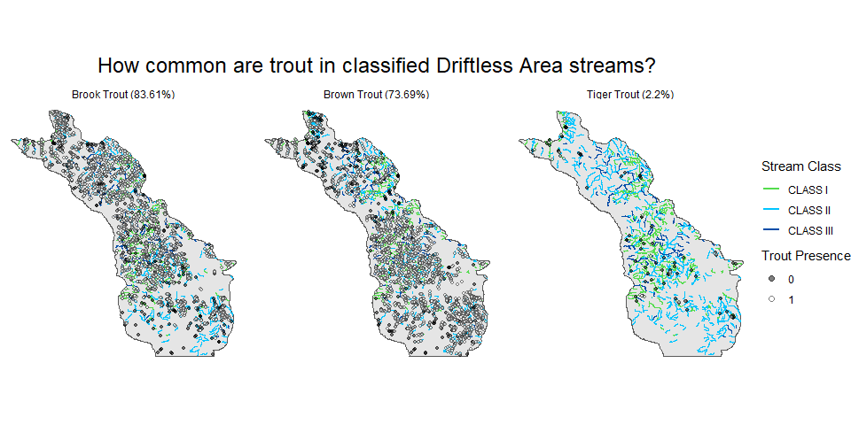

Driftless trout streams
================
Bryan Maitland
7 July 2021

## Overview

What is the percentage of Driftless area streams in which Brook, Brown,
or Tiger Trout are present?

``` r
library(tidyverse)
library(here)
library(wdnr.fmdb)
# set_fmdb_credentials()
library(rgdal)  
library(sf)
library(glue)
```

## Data

### Driftless ecoregion polygon and streams

``` r
# load driftless ecoregion polygon
poly_driftless <- 
  here("data", "ecoregions","wi_eco_l3.shp") %>% 
  st_read() %>% 
  st_transform(crs = 3071) %>% 
  filter(US_L3CODE == "52")

# load classified trout stream lines
lines_classed <- 
  here("data", "classified_trout_streams","Classified_Trout_Stream_Lines.shp") %>% 
  st_read() %>% 
  st_transform(crs = 3071) 

# clip the classified trout streams to driftless region
lines_classed_drift <- 
  lines_classed %>% 
  st_intersection(poly_driftless)
```

### FMDB surveys and efforts

Download all surveys from 1994-2020 on streams using backpack and stream
shockers:

``` r
# data pulled from FMDB in hidden step
df_surveys_raw <- read_rds(here("data", "surveys_raw_20210707.rds"))
df_efforts_raw <- read_rds(here("data", "efforts_raw_20210707.rds"))
```

### filter surveys/efforts for proofed data:

``` r
# list of good surveys status
targ.survs <- c(
  "data_entry_complete_and_proofed",
  "historical_data_complete_and_proofed",
  "historical_data_entry_complete",
  "historical_data_load_status_unknown"
  )

# filter surveys by unique efforts and status
df_surveys <- 
  df_surveys_raw %>% 
  filter(survey.seq.no %in% unique(df_efforts_raw$survey.seq.no)) %>% 
  filter(survey.status %in% targ.survs)

# filter effort on filtered surveys and remove 315 sites
df_efforts <- 
  df_efforts_raw %>% 
  filter(survey.seq.no %in% df_surveys$survey.seq.no) %>%
  filter(site.seq.no != 315)

# clean up
rm(df_surveys_raw); rm(df_efforts_raw)
```

### clip survey data to driftless region:

``` r
# first clip surveys to driftless area
df_surveys_drift <- 
  df_surveys %>% 
  st_as_sf(coords = c("longitude", "latitude"), crs = 4326) %>% 
  st_transform(crs = 3071) %>% 
  st_intersection(poly_driftless)

# then filter efforts to clipped surveys
df_efforts_drift <- 
  df_efforts %>% 
  filter(survey.seq.no %in% df_surveys_drift$survey.seq.no)

# isolate unique survey site locations in driftless
df_surveys_drift_locs <- 
  df_surveys_drift %>% 
  distinct(site.seq.no, .keep_all = TRUE) %>% 
  select(wbic, site.seq.no) 
```

### download fishraw data for driftless region surveys:

``` r
# data pulled from FMDB in hidden step
df_fish_raw <- 
  here("data", "fish_raw_20210727.rds") %>% 
  read_rds() 
```

## Inspect data

### count of surveys in driftless from 1994-2020:

    ## [1] 9395

### count of wbics that have been surveyed in the driftless:

    ## [1] 4354

### count of wbics that are classified trout stream flowlines:

    ## [1] 1011

### count of wbics in classified streams also surveyed:

#### join site locations to nearest classified flowline to get a site’s stream class:

``` r
df_surveys_drift_classed <- 
  df_surveys_drift_locs %>% 
  st_join(lines_classed_drift, join = nngeo::st_nn, k = 1, maxdist = 100)
```

    ##   |                                                                              |                                                                      |   0%  |                                                                              |                                                                      |   1%  |                                                                              |=                                                                     |   1%  |                                                                              |=                                                                     |   2%  |                                                                              |==                                                                    |   2%  |                                                                              |==                                                                    |   3%  |                                                                              |==                                                                    |   4%  |                                                                              |===                                                                   |   4%  |                                                                              |===                                                                   |   5%  |                                                                              |====                                                                  |   5%  |                                                                              |====                                                                  |   6%  |                                                                              |=====                                                                 |   6%  |                                                                              |=====                                                                 |   7%  |                                                                              |=====                                                                 |   8%  |                                                                              |======                                                                |   8%  |                                                                              |======                                                                |   9%  |                                                                              |=======                                                               |   9%  |                                                                              |=======                                                               |  10%  |                                                                              |=======                                                               |  11%  |                                                                              |========                                                              |  11%  |                                                                              |========                                                              |  12%  |                                                                              |=========                                                             |  12%  |                                                                              |=========                                                             |  13%  |                                                                              |=========                                                             |  14%  |                                                                              |==========                                                            |  14%  |                                                                              |==========                                                            |  15%  |                                                                              |===========                                                           |  15%  |                                                                              |===========                                                           |  16%  |                                                                              |============                                                          |  16%  |                                                                              |============                                                          |  17%  |                                                                              |============                                                          |  18%  |                                                                              |=============                                                         |  18%  |                                                                              |=============                                                         |  19%  |                                                                              |==============                                                        |  19%  |                                                                              |==============                                                        |  20%  |                                                                              |==============                                                        |  21%  |                                                                              |===============                                                       |  21%  |                                                                              |===============                                                       |  22%  |                                                                              |================                                                      |  22%  |                                                                              |================                                                      |  23%  |                                                                              |================                                                      |  24%  |                                                                              |=================                                                     |  24%  |                                                                              |=================                                                     |  25%  |                                                                              |==================                                                    |  25%  |                                                                              |==================                                                    |  26%  |                                                                              |===================                                                   |  26%  |                                                                              |===================                                                   |  27%  |                                                                              |===================                                                   |  28%  |                                                                              |====================                                                  |  28%  |                                                                              |====================                                                  |  29%  |                                                                              |=====================                                                 |  29%  |                                                                              |=====================                                                 |  30%  |                                                                              |=====================                                                 |  31%  |                                                                              |======================                                                |  31%  |                                                                              |======================                                                |  32%  |                                                                              |=======================                                               |  32%  |                                                                              |=======================                                               |  33%  |                                                                              |=======================                                               |  34%  |                                                                              |========================                                              |  34%  |                                                                              |========================                                              |  35%  |                                                                              |=========================                                             |  35%  |                                                                              |=========================                                             |  36%  |                                                                              |==========================                                            |  36%  |                                                                              |==========================                                            |  37%  |                                                                              |==========================                                            |  38%  |                                                                              |===========================                                           |  38%  |                                                                              |===========================                                           |  39%  |                                                                              |============================                                          |  39%  |                                                                              |============================                                          |  40%  |                                                                              |============================                                          |  41%  |                                                                              |=============================                                         |  41%  |                                                                              |=============================                                         |  42%  |                                                                              |==============================                                        |  42%  |                                                                              |==============================                                        |  43%  |                                                                              |==============================                                        |  44%  |                                                                              |===============================                                       |  44%  |                                                                              |===============================                                       |  45%  |                                                                              |================================                                      |  45%  |                                                                              |================================                                      |  46%  |                                                                              |=================================                                     |  46%  |                                                                              |=================================                                     |  47%  |                                                                              |=================================                                     |  48%  |                                                                              |==================================                                    |  48%  |                                                                              |==================================                                    |  49%  |                                                                              |===================================                                   |  49%  |                                                                              |===================================                                   |  50%  |                                                                              |===================================                                   |  51%  |                                                                              |====================================                                  |  51%  |                                                                              |====================================                                  |  52%  |                                                                              |=====================================                                 |  52%  |                                                                              |=====================================                                 |  53%  |                                                                              |=====================================                                 |  54%  |                                                                              |======================================                                |  54%  |                                                                              |======================================                                |  55%  |                                                                              |=======================================                               |  55%  |                                                                              |=======================================                               |  56%  |                                                                              |========================================                              |  56%  |                                                                              |========================================                              |  57%  |                                                                              |========================================                              |  58%  |                                                                              |=========================================                             |  58%  |                                                                              |=========================================                             |  59%  |                                                                              |==========================================                            |  59%  |                                                                              |==========================================                            |  60%  |                                                                              |==========================================                            |  61%  |                                                                              |===========================================                           |  61%  |                                                                              |===========================================                           |  62%  |                                                                              |============================================                          |  62%  |                                                                              |============================================                          |  63%  |                                                                              |============================================                          |  64%  |                                                                              |=============================================                         |  64%  |                                                                              |=============================================                         |  65%  |                                                                              |==============================================                        |  65%  |                                                                              |==============================================                        |  66%  |                                                                              |===============================================                       |  66%  |                                                                              |===============================================                       |  67%  |                                                                              |===============================================                       |  68%  |                                                                              |================================================                      |  68%  |                                                                              |================================================                      |  69%  |                                                                              |=================================================                     |  69%  |                                                                              |=================================================                     |  70%  |                                                                              |=================================================                     |  71%  |                                                                              |==================================================                    |  71%  |                                                                              |==================================================                    |  72%  |                                                                              |===================================================                   |  72%  |                                                                              |===================================================                   |  73%  |                                                                              |===================================================                   |  74%  |                                                                              |====================================================                  |  74%  |                                                                              |====================================================                  |  75%  |                                                                              |=====================================================                 |  75%  |                                                                              |=====================================================                 |  76%  |                                                                              |======================================================                |  76%  |                                                                              |======================================================                |  77%  |                                                                              |======================================================                |  78%  |                                                                              |=======================================================               |  78%  |                                                                              |=======================================================               |  79%  |                                                                              |========================================================              |  79%  |                                                                              |========================================================              |  80%  |                                                                              |========================================================              |  81%  |                                                                              |=========================================================             |  81%  |                                                                              |=========================================================             |  82%  |                                                                              |==========================================================            |  82%  |                                                                              |==========================================================            |  83%  |                                                                              |==========================================================            |  84%  |                                                                              |===========================================================           |  84%  |                                                                              |===========================================================           |  85%  |                                                                              |============================================================          |  85%  |                                                                              |============================================================          |  86%  |                                                                              |=============================================================         |  86%  |                                                                              |=============================================================         |  87%  |                                                                              |=============================================================         |  88%  |                                                                              |==============================================================        |  88%  |                                                                              |==============================================================        |  89%  |                                                                              |===============================================================       |  89%  |                                                                              |===============================================================       |  90%  |                                                                              |===============================================================       |  91%  |                                                                              |================================================================      |  91%  |                                                                              |================================================================      |  92%  |                                                                              |=================================================================     |  92%  |                                                                              |=================================================================     |  93%  |                                                                              |=================================================================     |  94%  |                                                                              |==================================================================    |  94%  |                                                                              |==================================================================    |  95%  |                                                                              |===================================================================   |  95%  |                                                                              |===================================================================   |  96%  |                                                                              |====================================================================  |  96%  |                                                                              |====================================================================  |  97%  |                                                                              |====================================================================  |  98%  |                                                                              |===================================================================== |  98%  |                                                                              |===================================================================== |  99%  |                                                                              |======================================================================|  99%  |                                                                              |======================================================================| 100%

#### count of classificed wbics that have been surveyed:

    ## [1] 726

#### count of class 1-2 wbics that have been surveyed:

    ## [1] 651

### plot of driftless survey sites and classified streams:


## Trout presence

### deal with zero captures

#### surveys where species = ‘no\_fish\_captured’:

``` r
# isolate zero
df_no_fish <- 
  df_fish_raw %>% 
  filter(species == "no_fish_captured") 
```

#### check and plot no captures:

    ## # A tibble: 5 x 2
    ##   `Target species` Count
    ##   <chr>            <int>
    ## 1 all species        179
    ## 2 gamefish species    70
    ## 3 brook trout         13
    ## 4 brown trout          3
    ## 5 trouts unsp          1

    ## # A tibble: 21 x 2
    ##    `Primary Survey Purpose`             Count
    ##    <chr>                                <int>
    ##  1 fisheries assessments trout rotation    62
    ##  2 special study                           57
    ##  3 comprehensive survey                    54
    ##  4 baseline monitoring                     28
    ##  5 watershed clean water act               13
    ##  6 general survey                           8
    ##  7 baseline random                          5
    ##  8 fisheries assessments trout trend        5
    ##  9 natural community reference              5
    ## 10 stocking evaluation                      4
    ## # ... with 11 more rows


#### convert no captures to species-specific zeros and subset trout data:

Given the target species of a survey, a zero is added for brooks or
browns or both:

``` r
df_fish <- 
  df_fish_raw %>% 
  filter(!species == "no_fish_captured") %>%
  bind_rows(df_trout_0s) %>%  # this df is made in a hidden step previous to this
  mutate(species = if_else(species == "tiger_trout_(i21_x_i22)", "tiger_trout", species)) %>% 
  filter(species %in% c("brook_trout","brown_trout","tiger_trout"))
```

## count of surveyed wbics in which trout are present

### convert catch data to presence data:

``` r
# convert catch data to presence
df_fish_presence <-
  df_fish %>% 
  group_by(wbic, site.seq.no, species) %>% 
  summarise(n = sum((number.of.fish)), .groups = "drop") %>% 
  mutate(n = if_else(n > 1, 1, 0)) %>% 
  # join survey metadata for coords/classes
  left_join(df_surveys_drift_classed %>% 
              select(site.seq.no, TROUT_CLAS), by = "site.seq.no") 

# check species counts
df_fish_presence %>% 
  count(species, n)
```

    ## # A tibble: 6 x 3
    ##   species         n    nn
    ##   <chr>       <dbl> <int>
    ## 1 brook_trout     0   421
    ## 2 brook_trout     1  1879
    ## 3 brown_trout     0   385
    ## 4 brown_trout     1  2062
    ## 5 tiger_trout     0    75
    ## 6 tiger_trout     1    25

``` r
# check class counts
df_fish_presence %>% 
  count(TROUT_CLAS)
```

    ## # A tibble: 4 x 2
    ##   TROUT_CLAS     n
    ##   <chr>      <int>
    ## 1 CLASS I     1486
    ## 2 CLASS II    2183
    ## 3 CLASS III    342
    ## 4 <NA>         836

### get counts for unique wbics with trout present on classified waters:

``` r
# count of streams in which brown trout were present
n.wbics.bnt.p <- 
  df_fish_presence %>% 
  filter(species == "brown_trout", n == 1) %>% 
  select(-geometry) %>% 
  distinct(wbic) %>% 
  pull() %>% 
  length()

# count of 1-2 class streams in which brown trout were present
n.wbics.bnt.p.12 <- 
  df_fish_presence %>% 
  filter(TROUT_CLAS %in% c("CLASS I", "CLASS II") ) %>% 
  filter(species == "brown_trout", n == 1) %>% 
  select(-geometry) %>% 
  distinct(wbic) %>% 
  pull() %>% 
  length()

# count of streams in which brown trout were present
n.wbics.bkt.p <- 
  df_fish_presence %>% 
  filter(species == "brook_trout", n == 1) %>% 
  select(-geometry) %>% 
  distinct(wbic) %>% 
  pull() %>% 
  length()

# count of 1-2 class streams in which brown trout were present
n.wbics.bkt.p.12 <- 
  df_fish_presence %>% 
  filter(TROUT_CLAS %in% c("CLASS I", "CLASS II") ) %>% 
  filter(species == "brook_trout", n == 1) %>% 
  select(-geometry) %>% 
  distinct(wbic) %>% 
  pull() %>% 
  length()

# count of streams in which brown trout were present
n.wbics.tiger.p <- 
  df_fish_presence %>% 
  filter(species == "tiger_trout", n == 1) %>% 
  select(-geometry) %>% 
  distinct(wbic) %>% 
  pull() %>% 
  length()

# count of 1-2 class streams in which brown trout were present
n.wbics.tiger.p.12 <- 
  df_fish_presence %>% 
  filter(TROUT_CLAS %in% c("CLASS I", "CLASS II") ) %>% 
  filter(species == "tiger_trout", n == 1) %>% 
  select(-geometry) %>% 
  distinct(wbic) %>% 
  pull() %>% 
  length()
```

### calculate percentages

#### brown trout

``` r
# class 1-3
(percent.wbics.bnt.present <- round((n.wbics.bnt.p/n.wbics.classed.surveyed) * 100, digits = 2))
```

    ## [1] 73.69

``` r
# class 1-2
(percent.wbics.bnt.present12 <- round((n.wbics.bnt.p.12/n.wbics.classed12.surveyed) * 100, digits = 2))
```

    ## [1] 61.14

#### brook trout

``` r
# class 1-3
(percent.wbics.bkt.present <- round((n.wbics.bkt.p/n.wbics.classed.surveyed) * 100, digits = 2))
```

    ## [1] 83.61

``` r
# class 1-2
(percent.wbics.bkt.present12 <- round((n.wbics.bkt.p.12/n.wbics.classed12.surveyed) * 100, digits = 2))
```

    ## [1] 69.28

#### tiger trout

``` r
# class 1-3
(percent.wbics.tgt.present <- round((n.wbics.tiger.p/n.wbics.classed.surveyed) * 100, digits = 2))
```

    ## [1] 2.2

``` r
# class 1-2
(percent.wbics.tgt.present12 <- round((n.wbics.tiger.p.12/n.wbics.classed12.surveyed) * 100, digits = 2))
```

    ## [1] 2.46

### plot presence/absence


