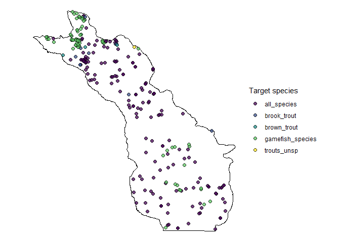

How common are trout in Driftless streams
================
Bryan Maitland
29 July 2021

## Overview

What is the percentage of Driftless area streams in which Brook, Brown,
or Tiger Trout are present?

## 1\. Data

### FMDB surveys and efforts

Download all surveys from 1994-2020 on streams using backpack and stream
shockers, retaining only surveys that are complete and proofed:

``` r
# data pulled from FMDB in hidden step
df_surveys_raw <- read_rds(here("data", "surveys_raw_20210707.rds"))
df_efforts_raw <- read_rds(here("data", "efforts_raw_20210707.rds"))
```

### clip survey data to driftless region:

``` r
# first clip surveys to driftless area
df_surveys_drift <- 
  df_surveys %>% 
  st_as_sf(coords = c("longitude", "latitude"), crs = 4326) %>% 
  st_transform(crs = 3071) %>% 
  st_intersection(poly_driftless)

# then filter efforts to clipped surveys
df_efforts_drift <- 
  df_efforts %>% 
  filter(survey.seq.no %in% df_surveys_drift$survey.seq.no)

# isolate unique survey site locations in driftless
df_surveys_drift_locs <- 
  df_surveys_drift %>% 
  distinct(site.seq.no, .keep_all = TRUE) %>% 
  select(wbic, site.seq.no) 
```

### download fishraw data for driftless region surveys:

``` r
# data pulled from FMDB in hidden step
df_fish_raw <- 
  here("data", "fish_raw_20210727.rds") %>% 
  read_rds() 
```

## 2\. Count of surveys and streams (wbics)

#### number of distinct surveys in driftless from 1994-2020:

    ## [1] 9395

#### number of distinct wbics in driftless suvrvey data:

    ## [1] 4354

#### number of distinct wbics in classified trout streams layer:

    ## [1] 1011

and by class:

    ##   TROUT_CLAS   n
    ## 1    CLASS I 368
    ## 2   CLASS II 518
    ## 3  CLASS III 125

#### number of surveyed wbics in the driftless also on classified streams:

To do this, we need to join sites to nearest classified stream to get a
site’s stream class (so sites that are not on or near a classified
stream get an NA for stream class.

##### number of surveyed wbics in the driftless also on classified streams:

    ## [1] 726

##### number of surveyed wbics in the driftless also on classified streams I/II:

    ## [1] 651

### plot of driftless survey sites and classified streams:


## 3\. Trout presence/abscence

#### isolate and plot zero captures



#### convert to species-specific zeros and subset trout data:

``` r
df_fish <- 
  df_fish_raw %>% 
  filter(!species == "no_fish_captured") %>%
  bind_rows(df_trout_0s) %>%  # this df is made in a hidden step previous to this
  mutate(species = if_else(species == "tiger_trout_(i21_x_i22)", "tiger_trout", species)) %>% 
  filter(species %in% c("brook_trout","brown_trout","tiger_trout"))
```

### count of surveyed wbics in which trout are present:

#### convert catch data to presence data:

``` r
# convert catch data to presence
df_fish_presence <-
  df_fish %>% 
  group_by(wbic, survey.seq.no, species) %>% 
  summarise(n = sum((number.of.fish)), .groups = "drop") %>% 
  mutate(n = if_else(n > 1, 1, 0))

wide <- 
  df_fish_presence %>% 
  pivot_wider(names_from = species, values_from = n, values_fill = 0) %>% 
  mutate(symp = brook_trout + brown_trout) %>% 
  mutate(symp = if_else(symp == 2, 1, 0))

n.wbics.bnt.p <- 
  wide %>% 
  select(wbic, brown_trout) %>% 
  filter(brown_trout == 1) %>% 
  pull(wbic) %>% 
  unique() %>% 
  length()

n.wbics.bkt.p <- 
  wide %>% 
  select(wbic, brook_trout) %>% 
  filter(brook_trout == 1) %>% 
  pull(wbic) %>% 
  unique() %>% 
  length()

n.wbics.tiger.p <- 
  wide %>% 
  select(wbic, tiger_trout) %>% 
  filter(tiger_trout == 1) %>% 
  pull(wbic) %>% 
  unique() %>% 
  length()

n.wbics.symp.p <- 
  wide %>% 
  select(wbic, symp) %>% 
  filter(symp == 1) %>% 
  pull(wbic) %>% 
  unique() %>% 
  length()
```

#### count of surveyed wbics in which trout are present

## 4\. calculate percentages

#### brown trout

``` r
(percent.wbics.bnt.present <- round((n.wbics.bnt.p/n.wbics.classed.surveyed) * 100, digits = 2))
```

    ## [1] 73.55

``` r
# (percent.wbics.bnt.present12 <- round((n.wbics.bnt.p.12/n.wbics.classed12.surveyed) * 100, digits = 2))
```

#### brook trout

``` r
(percent.wbics.bkt.present <- round((n.wbics.bkt.p/n.wbics.classed.surveyed) * 100, digits = 2))
```

    ## [1] 83.06

``` r
# (percent.wbics.bkt.present12 <- round((n.wbics.bkt.p.12/n.wbics.classed12.surveyed) * 100, digits = 2))
```

#### tiger trout

``` r
(percent.wbics.tgt.present <- round((n.wbics.tiger.p/n.wbics.classed.surveyed) * 100, digits = 2))
```

    ## [1] 2.2

``` r
# (percent.wbics.tgt.present12 <- round((n.wbics.tiger.p.12/n.wbics.classed12.surveyed) * 100, digits = 2))
```

#### brook/brown sympatry

``` r
(percent.wbics.tgt.present <- round((n.wbics.symp.p/n.wbics.classed.surveyed) * 100, digits = 2))
```

    ## [1] 43.11

### plot presence/absence

``` r
panel_labels <- c(
  `brook_trout` = glue("Brook Trout ({percent.wbics.bkt.present}%)"),
  `brown_trout` = glue("Brown Trout ({percent.wbics.bnt.present}%)"),
  `tiger_trout` = glue("Tiger Trout ({percent.wbics.tgt.present}%)")
  )

ggplot() + 
  geom_sf(data = poly_driftless, fill = "white") +
  geom_sf(data = lines_classed_drift, 
          aes(color = TROUT_CLAS), show.legend = "line") +
  # geom_sf(data = df_surveys_drift_locs_classes %>% filter(is.na(TROUT_CLAS)),
  #         size = 1, shape = 16, color = "grey", alpha = 0.25) +
  geom_sf(data = df_fish_presence %>% st_as_sf(), 
          aes(fill = as.factor(n)), show.legend = "point",
          shape = 21, size = 1, alpha = 0.5) + 
  scale_colour_manual(
    values = c("#53DC4D", "#00C5ff", "#004DA8"), 
    guide = guide_legend(
      override.aes = list(linetype = c("solid", "solid","solid"), 
                          shape = c(NA, NA, NA),
                          size = c(1,1,1)))
    ) +
  scale_fill_manual(
    values = c("black", "white"), 
    labels = c("Absent", "Present"),
    guide = guide_legend(
      override.aes = list(linetype = "blank",
                          shape = 21, alpha = 1,
                          size = 2))
    ) +
  facet_wrap(vars(species), labeller = as_labeller(panel_labels)) +
  labs(
    # title = "How common are trout in Driftless Area streams?",
    title ="Percent of all classified and surveyed streams with trout present:",
    # subtitle ="Percent of all classified and surveyed streams with trout present:",
    # caption = "Note: light grey dots depict all surveys sites in the region",
    color = "Stream Class", 
    fill = "Trout Presence") + 
  theme_void() + 
  theme(
    plot.title = element_text(hjust = 0.5, family = "sans", size = 18, margin=margin(0,0,5,0)), 
    plot.subtitle = element_text(hjust = 0.5, family = "sans", size = 12, margin=margin(0,0,10,0))
    )

path <- here::here("plots", "driftless_trout_presence")
ggsave(glue::glue("{path}.pdf"), width = 10, height = 5, device = cairo_pdf)
pdftools::pdf_convert(pdf = glue::glue("{path}.pdf"),
            filenames = glue::glue("{path}.png"),
            format = "png", dpi = 300)
```
